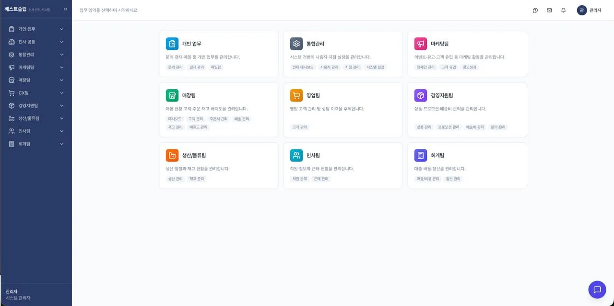

# Raw Assignment Reference

This file preserves the original assignment wording as a reference input.
Use it as the raw source for interpretation. Structured contracts live in `docs/feature-requirements.md`, `docs/ui-guidelines.md`, `docs/app-architecture.md`, `docs/api-spec.md`, and `docs/database-schema.md`.

# 과제: 비콘 기반 출퇴근 관리 시스템

## 배경

베스트슬립은 현재 사내 ERP 시스템을 자체 개발하여 운영 중입니다. 이번에 BLE 비콘을 활용한 출퇴근 자동 인증 기능을 ERP에 추가하려 합니다. 본 과제는 이 출퇴근 관리 모듈의 프론트엔드를 구현하는 것입니다.

실제 운영 중인 ERP 화면 캡쳐를 레퍼런스로 제공하니, 기존 시스템과 어울리는 UI를 만들어주세요.

---

## 기술 스택

| 항목 | 사양 |
| --- | --- |
| 프레임워크 | Next.js (App Router) — 필수 |
| 언어 | TypeScript — 필수 |
| 스타일링 | 자유 (Tailwind, CSS Modules, styled-components 등) |
| 상태관리 | 자유 (React state, Zustand, Jotai 등) |
| API | 아래 Mock API 명세에 맞춰 구현 |

---

## 🎨 디자인 레퍼런스

아래는 현재 운영 중인 베스트슬립 ERP 화면입니다. 이 톤앤매너에 맞춰 작업해주세요.



핵심 디자인 키워드:

- 좌측 사이드바 네비게이션
- 카드 기반 레이아웃
- 보라/파랑 계열 메인 컬러
- 깔끔하고 실무적인 느낌 (과하지 않은 장식)

## 만들어야 할 화면 (총 4개)

### 화면 1. 내 출퇴근 현황 (/attendance)

직원이 자기 출퇴근 상태를 확인하는 메인 페이지입니다.

- [ ] 오늘 출퇴근 상태 카드 — 출근 시간, 퇴근 시간, 비콘 인증 여부 표시
- [ ] 이번 주 출퇴근 기록 테이블 — 날짜 | 출근 | 퇴근 | 근무시간 | 상태(정상/지각/조퇴/결근)
- [ ] 월간 보기 탭 — 같은 테이블인데 이번 달 전체
- [ ] 수동 출퇴근 신청 버튼 — 비콘 미감지 시 사유 작성 후 수동 신청

고려할 점: 출근만 찍고 퇴근 안 찍은 경우? 비콘 범위 밖에서 앱을 열면?

### 화면 2. 연차/반차 신청 (/attendance/leave)

직원이 휴가를 신청하고 내역을 확인하는 페이지입니다.

- [ ] 잔여 연차 카드 — 총 연차 / 사용 / 잔여 표시
- [ ] 신청 폼 — 유형(연차/오전반차/오후반차/시간차), 날짜, 사유
- [ ] 내 신청 내역 리스트 — 날짜 | 유형 | 사유 | 상태(대기/승인/반려)

고려할 점: 과거 날짜에 연차 신청 가능? 같은 날 중복 신청 방지는?

### 화면 3. 팀 출퇴근 대시보드 (/admin/attendance)

관리자가 팀원 전체의 출퇴근 현황을 한눈에 보는 페이지입니다.

- [ ] 오늘 요약 카드 — 출근 OO명 / 미출근 OO명 / 지각 OO명 / 연차 OO명
- [ ] 팀원 출퇴근 테이블 — 이름 | 부서 | 출근 | 퇴근 | 상태 (필터/검색)
- [ ] 날짜 범위 필터 — 기간 선택해서 과거 기록 조회
- [ ]

고려할 점: 50명 데이터 페이지네이션? 부서별 필터?

### 화면 4. 신청 관리 (/admin/attendance/requests)

관리자가 수동 출퇴근/연차 신청을 승인·반려하는 페이지입니다.

- [ ] 신청 목록 테이블 — 신청자 | 유형 | 날짜 | 사유 | 상태
- [ ] 필터 탭 — 대기중 / 승인 / 반려 / 전체
- [ ] 승인/반려 버튼 — 클릭 시 확인 모달, 반려 시 사유 입력

고려할 점: 일괄 승인? 승인 후 되돌리기?

---

## Mock API 명세

백엔드는 아직 없습니다. 아래 API를 Next.js Route Handler나 MSW 등으로 직접 mock 구현해주세요.

```txt
# 직원용
GET  /api/attendance/me           → 오늘 출퇴근 상태
GET  /api/attendance/me/history   → 기록 조회 (?from=&to=)
POST /api/attendance/manual       → 수동 출퇴근 신청
GET  /api/leave/me                → 연차 잔여/내역
POST /api/leave/request           → 연차/반차 신청

# 관리자용
GET   /api/admin/attendance/today → 오늘 전체 현황
GET   /api/admin/attendance/list  → 기록 조회 (?from=&to=&name=)
GET   /api/admin/requests         → 신청 목록 (?status=pending)
PATCH /api/admin/requests/:id     → 승인/반려
```

Mock 데이터는 현실적으로 만들어주세요 (예: 직원 10~20명, 한 달치 출퇴근 기록, 지각/결근 케이스 포함).
